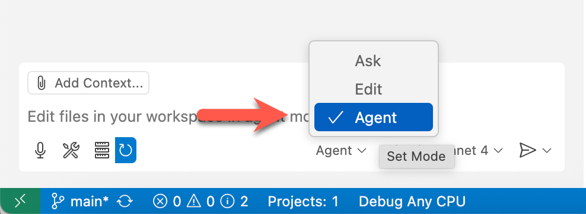

# 01: MCP를 사용한 Monkey 앱 개발

이 단계에서는 MCP 서버를 사용하여 간단한 콘솔 앱을 구축합니다.

## 전제 조건

준비에 대해서는 [README](../README.md#전제-조건) 문서를 참조하세요.

## 시작하기

- [GitHub Copilot 에이전트 모드 확인](#github-copilot-에이전트-모드-확인)
- [사용자 정의 지침 준비](#사용자-정의-지침-준비)
- [MCP 서버 개발 준비](#mcp-서버-개발-준비)
- [할 일 목록 관리 로직 개발](#할-일-목록-관리-로직-개발)
- [API 로직 제거](#api-로직-제거)
- [MCP 서버로 변환](#mcp-서버로-변환)
- [MCP 서버 실행](#mcp-서버-실행)
- [MCP 서버 테스트](#mcp-서버-테스트)

## GitHub Copilot 에이전트 모드 확인

1. GitHub Codespace 또는 VS Code 상단의 GitHub Copilot 아이콘을 클릭하고 GitHub Copilot 창을 엽니다.

   

1. 로그인 또는 가입을 요청받으면 진행하세요. 무료입니다.
1. GitHub Copilot 에이전트 모드를 사용하고 있는지 확인하세요.

   

1. 모델을 `GPT-4.1` 또는 `Claude Sonnet 4` 중 하나로 선택하세요.
1. [MCP 서버](./00-setup.md#mcp-서버-설정)를 구성했는지 확인하세요.

## MCP 서버 시작 &ndash; GitHub

1. `F1` 또는 Windows에서 `Ctrl`+`Shift`+`P`, Mac OS에서 `Cmd`+`Shift`+`P`를 입력하여 명령 팔레트를 열고 `MCP: List Servers`를 검색합니다.
1. `github`을 선택한 다음 `Start Server`를 클릭합니다. 이 MCP 서버를 사용하기 위해 GitHub에 로그인하라는 메시지가 표시될 수 있습니다.

## 사용자 정의 지침 준비

1. `$REPOSITORY_ROOT` 환경 변수를 설정합니다.

   ```bash
   # bash/zsh
   REPOSITORY_ROOT=$(git rev-parse --show-toplevel)
   ```

   ```powershell
   # PowerShell
   $REPOSITORY_ROOT = git rev-parse --show-toplevel
   ```

1. 사용자 정의 지침을 복사합니다.

    ```bash
    # bash/zsh
    cp $REPOSITORY_ROOT/docs/.github/monkeyapp-instructions.md \
       $REPOSITORY_ROOT/.github/copilot-instructions.md
    ```

    ```powershell
    # PowerShell
    Copy-Item -Path $REPOSITORY_ROOT/docs/.github/monkeyapp-instructions.md `
              -Destination $REPOSITORY_ROOT/.github/copilot-instructions.md -Force
    ```

1. `.github/copilot-instructions.md`를 열고 `https://github.com/YOUR_USERNAME/YOUR_REPO_NAME`을 여러분의 것으로 바꿉니다. 예: `https://github.com/octocat/monkey-app`.

## 콘솔 앱 생성

1. `workshop` 디렉토리 아래에 콘솔 앱을 생성합니다.

    ```bash
    # bash/zsh
    mkdir -p $REPOSITORY_ROOT/workshop
    cd $REPOSITORY_ROOT/workshop
    dotnet new console -n MyMonkeyApp
    ```

    ```powershell
    # PowerShell
    New-Item -Type Directory -Path $REPOSITORY_ROOT/workshop -Force
    cd $REPOSITORY_ROOT/workshop
    dotnet new console -n MyMonkeyApp
    ```

## GitHub 저장소 관리

1. 생성된 콘솔 앱을 푸시하기 위해 GitHub Copilot에 다음 프롬프트를 입력합니다.

    ```text
    Push the current changes to the `main` branch of the repository.
    ```

1. 저장소에 이슈를 생성하기 위해 GitHub Copilot에 다음 프롬프트를 입력합니다.

    ```text
    Create a new GitHub issue in my repository titled 'Implement Monkey Console Application' with the following requirements:
    
    - Create a C# console app that can list all available monkeys, get details for a specific monkey by name, and pick a random monkey.
    - The app should use a Monkey model class and include ASCII art for visual appeal.
    - Add appropriate labels like 'enhancement' and 'good first issue'.
    - Add some details about how we may go about implementing this and a checklist for what we will need to do.
    ```

1. 이슈에 `@Copilot`을 할당하고 무슨 일이 일어나는지 관찰합니다.

## MCP 서버 시작 &ndash; Monkey MCP

1. `F1` 또는 Windows에서 `Ctrl`+`Shift`+`P`, Mac OS에서 `Cmd`+`Shift`+`P`를 입력하여 명령 팔레트를 열고 `MCP: List Servers`를 검색합니다.
1. `github` MCP 서버가 실행 중인지 확인합니다.
1. `monkeymcp`를 선택한 다음 `Start Server`를 클릭합니다.

## GitHub Copilot과 MCP 서버로 Monkey 앱 개발

1. 원숭이 목록을 얻기 위해 다음 프롬프트를 입력합니다.

    ```text
    Get me a list of monkeys that are available and display them in a table with their details.
    ```

1. 원숭이의 데이터 모델에 대한 아이디어를 얻기 위해 다음 프롬프트를 입력합니다.

    ```text
    What would a data model look like for this structure?
    ```

1. 데이터 모델 클래스를 위한 파일을 생성하기 위해 다음 프롬프트를 입력합니다.

    ```text
    Let's create a new file for this class.
    ```

1. `MonkeyHelper` 클래스를 생성하기 위해 다음 프롬프트를 입력합니다.

    ```text
    Let's create a new class called MonkeyHelper that is static. It should manage a collection of monkey data. Include methods to get all monkeys, get a random monkey, find a monkey by name, and track access count to when a random monkey is picked. The data for the monkeys should come from the Monkey MCP server that we just got.
    ```

1. 콘솔 앱을 업데이트하기 위해 다음 프롬프트를 입력합니다.

    ```text
    Let's update the app now to have a nice menu with the following options that will call into that `MonkeyHelper`.
    
    1. List all monkeys
    2. Get details for a specific monkey by name
    3. Get a random monkey
    4. Exit app

    Also display some funny ASCII art randomly.
    ```

1. 업데이트된 콘솔 앱을 푸시하기 위해 GitHub Copilot에 다음 프롬프트를 입력합니다.

    ```text
    Push the current changes to the `mymonkeyapp` branch of the repository.
    With this branch, create a PR against the `main` branch.
    Connect this PR to the issue created before.
    Then, merge this PR and close the issue.
    ```

---

좋습니다. "MCP를 사용한 Monkey 앱 개발" 단계를 완료했습니다. [STEP 02: MCP 서버](./02-mcp-server.md)로 이동합시다.